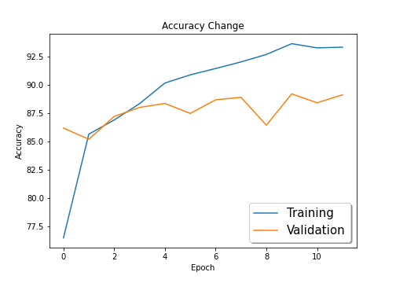
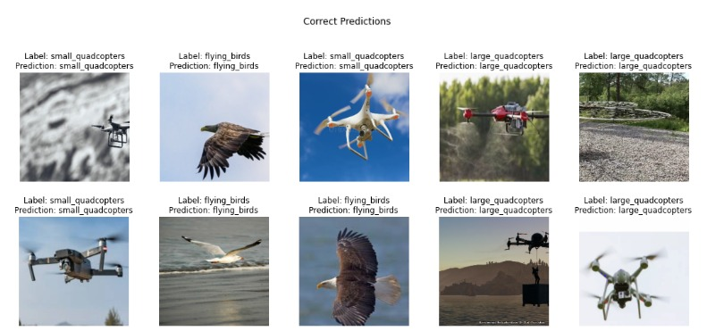
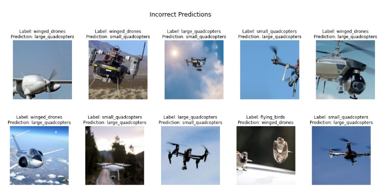

# Session 2 - MobileNetV2

In this assignment we have trained a model on a dataset with nearly 22,000 images collected from various sources. The images consist of flying objects. The entire dataset is divided into 4 classes - Flying Birds, Large Quadcopters, Small Quadcopters, and Winged Drones. We have named this dataset as IFO Dataset. The model trained has an underlying architecture of Mobilenet V2.
The prime objective of this assignment is to deploy this model on AWS lambda after training and to be able to classify images using a POST request from the URL generated after deployment.  

The model reaches a test accuracy of **89.20%** and has been trained for **12 Epochs**.

API Link: [https://5a7jq62zm2.execute-api.ap-south-1.amazonaws.com/dev/classify](https://5a7jq62zm2.execute-api.ap-south-1.amazonaws.com/dev/classify)

## Hyperparameters

- Loss Function: Cross Entropy Loss
- Optimizer: SGD
- Learning Rate: 0.01
- Data Augmentation
  - Random Resize Crop
- Reduce LR on Plateau  
- Batch Size: 256
- Epochs: 12

## Results

The model achieves the highest validation accuracy of **89.20%**

### Accuracy Plot



### Predictions

#### Correctly Classified Images



#### Misclassified Images



### Deployment on AWS Lambda

- Save the trained model to cpu
- Modify the handler.py and serverless.yml according to the transforms we want to apply on our images and our bucket name and saved model file name.  
- Create a template which creates package.json file. Add requirements.txt manually.
- Finally run the command sls deploy on terminal.  

And there you go! Within 8-10 mins your model shall be live.  
It might happen that the first attempt of testing the API on Postman or Insomnia may give time-out error. Retry in that case.  

## Testing on Custom Image

API Link: [https://5a7jq62zm2.execute-api.ap-south-1.amazonaws.com/dev/classify](https://5a7jq62zm2.execute-api.ap-south-1.amazonaws.com/dev/classify)

Send a POST request to the link above with the image that needs to be classified.

## The Dataset

The original dataset contains these 4 classes and below is the count of number of images in each folder.   

- flying_birds - 8338
- large_quadcopters - 4169
- small_quadcopters - 3623
- winged_drones - 5675

### Cleaning the Dataset

The dataset initially had many irrelevant images, hence we cleaned the data foremost. Following techniques were applied:

- Remove all the image that were not in .jpeg, .jpg and .png format
- Convert .png to .jpeg
- Convert images that had channel 1 or 4 to 3 channel image (RGB)
- Removed all the image that had resolution below than 150x150 (In our experiments, we found that image with resolution below 150x150 were getting distorted upon resizing to 224x224)

Cleaned dataset count:

- flying_birds - 8115
- large_quadcopters - 4097
- small_quadcopters - 3137
- winged_drones - 5540

### Resizing Strategy: RandomResizedCrop

```[python]
transforms.RandomResizedCrop(224)
```

Crop the given image to random scale and aspect ratio. This is popularly used to train the Inception networks.

This will extract a patch of size (224, 224) from input image randomly. So, it might pick this path from topleft, bottomright or anywhere in between.

1. **Utilizing entire 224x224 (each pixel)** to represent input image unlike other techqniues e.g. center aligned on mask which add black border/padding.
2. In this part, we are also doing **data augmentation** to increase the variability of the input images, as a result, model has higher robustness to the images obtained from different environments which is much better than simple resizing `transforms.Resize(size=224)`

### Class Imbalance problem 

**Resampling** came to rescue! It consists of less samples from the majority class and/or adding more examples from the minority class.

<p align="center">
  
</p>

```[python]
train_loader = torch.utils.data.DataLoader(dataset_train, batch_size, sampler=sampler)
```

## MobilenetV2 Architecture


## Code Structure

### Dataset Preparation

- The first followed task was to clean the dataset.
  - Code used for data cleaning can be found [here](https://github.com/Divya932/EVA4-Phase-2/blob/master/Session02%20-%20MobileNetV2/api/data/cleaning.py).  
  
- The data has then been split into train and test set in a ratio of _70:30_.
- A Dataset class is then created to load the data and for other useful functionalities. [[code for dataset class](https://github.com/Divya932/EVA4-Phase-2/blob/master/Session02%20-%20MobileNetV2/api/data/dataset.py)]
  - Code for data augmentation and data loader creation can be found [here](https://github.com/Divya932/EVA4-Phase-2/blob/master/Session02%20-%20MobileNetV2/api/data/processing.py)
### Model Creation

- A `BaseModel` class is created which acts a wrapper around the model. This class can be found [here](https://github.com/Divya932/EVA4-Phase-2/blob/master/Session02%20-%20MobileNetV2/api/models/base_model.py).
- A pre-trained MobileNet V2 model was downloaded using [this](https://github.com/Divya932/EVA4-Phase-2/blob/master/Session02%20-%20MobileNetV2/api/models/mobilenetv2.py) code. The model is wrapped by the model wrapper described above.
- The last layer of the model is then modified to make predictions on only **4 classes** as the original model was designed to make predictions on 1000 classes.
  ```[python]
  model = mobilenet_v2(pretrained=True)
  model.classifier[1] = torch.nn.Linear(1280, 4)
  ```

### Model Training and Evaluation  
- Code for model training and evaluation [here](https://github.com/Divya932/EVA4-Phase-2/blob/master/Session02%20-%20MobileNetV2/phase2_session2.ipynb)  
A look at the training logs here:  
Creating a learner object.
Epoch 1:  
11/58 [>.......] - ETA: 11:34 - loss: 0.8700 - accuracy: 45.0745

13/58 [>.......] - ETA: 9:59 - loss: 0.8246 - accuracy: 47.5569 

16/58 [=>......] - ETA: 7:43 - loss: 0.7837 - accuracy: 50.5700

31/58 [===>....] - ETA: 3:23 - loss: 0.6561 - accuracy: 59.3248

32/58 [===>....] - ETA: 3:19 - loss: 0.6475 - accuracy: 59.7103

35/58 [===>....] - ETA: 3:11 - loss: 0.6291 - accuracy: 60.7954

58/58 [========] - 324s 6s/step - loss: 0.5521 - accuracy: 66.4241

Validation set (took 3 minutes, 41 seconds): Average loss: 0.0014, accuracy: 86.19

val_accuracy improved from -inf to 86.19000. Saving model to checkpoints/model.pt

Epoch 2:  

 0/58 [........] - ETA: 0s - loss: 0.0000e+00 - accuracy: 0.0000e+00

 6/58 [........] - ETA: 29:06 - loss: 0.4250 - accuracy: 82.3817

22/58 [==>.....] - ETA: 6:53 - loss: 0.3964 - accuracy: 83.2355

25/58 [==>.....] - ETA: 6:04 - loss: 0.3940 - accuracy: 83.3860

50/58 [=====>..] - ETA: 56s - loss: 0.3696 - accuracy: 84.2604 

58/58 [========] - 362s 6s/step - loss: 0.3722 - accuracy: 84.4452

Validation set (took 3 minutes, 31 seconds): Average loss: 0.0016, accuracy: 85.2

Epoch 3:

 4/58 [........] - ETA: 32:47 - loss: 0.3525 - accuracy: 87.2375

17/58 [=>......] - ETA: 8:26 - loss: 0.3576 - accuracy: 86.7047
/usr/local/lib/python3.6/dist-packages/PIL/Image.py:932: UserWarning: Palette images with Transparency expressed in bytes should be converted to RGBA images
  "Palette images with Transparency expressed in bytes should be "
18/58 [=>......] - ETA: 8:55 - loss: 0.3556 - accuracy: 86.7044
/usr/local/lib/python3.6/dist-packages/PIL/TiffImagePlugin.py:788: UserWarning: Corrupt EXIF data.  Expecting to read 4 bytes but only got 0. 
  warnings.warn(str(msg))
58/58 [========] - 341s 6s/step - loss: 0.3443 - accuracy: 86.6369

Validation set (took 3 minutes, 23 seconds): Average loss: 0.0014, accuracy: 87.21

val_accuracy improved from 86.19000 to 87.21000. Saving model to checkpoints/model.pt

Epoch 4:

15/58 [=>......] - ETA: 10:27 - loss: 0.3367 - accuracy: 87.4080
/usr/local/lib/python3.6/dist-packages/PIL/Image.py:932: UserWarning: Palette images with Transparency expressed in bytes should be converted to RGBA images
  "Palette images with Transparency expressed in bytes should be "
31/58 [===>....] - ETA: 4:31 - loss: 0.3168 - accuracy: 87.4532
/usr/local/lib/python3.6/dist-packages/PIL/Image.py:932: UserWarning: Palette images with Transparency expressed in bytes should be converted to RGBA images
  "Palette images with Transparency expressed in bytes should be "
33/58 [===>....] - ETA: 4:17 - loss: 0.3170 - accuracy: 87.4736
/usr/local/lib/python3.6/dist-packages/PIL/Image.py:932: UserWarning: Palette images with Transparency expressed in bytes should be converted to RGBA images
  "Palette images with Transparency expressed in bytes should be "
58/58 [========] - 366s 6s/step - loss: 0.3043 - accuracy: 87.7531
/usr/local/lib/python3.6/dist-packages/PIL/Image.py:932: UserWarning: Palette images with Transparency expressed in bytes should be converted to RGBA images
  "Palette images with Transparency expressed in bytes should be "
/usr/local/lib/python3.6/dist-packages/PIL/Image.py:932: UserWarning: Palette images with Transparency expressed in bytes should be converted to RGBA images
  "Palette images with Transparency expressed in bytes should be "
/usr/local/lib/python3.6/dist-packages/PIL/Image.py:932: UserWarning: Palette images with Transparency expressed in bytes should be converted to RGBA images
  "Palette images with Transparency expressed in bytes should be "
Validation set (took 3 minutes, 8 seconds): Average loss: 0.0013, accuracy: 88.01

val_accuracy improved from 87.21000 to 88.01000. Saving model to checkpoints/model.pt

Epoch 5:
/usr/local/lib/python3.6/dist-packages/PIL/Image.py:932: UserWarning: Palette images with Transparency expressed in bytes should be converted to RGBA images
  "Palette images with Transparency expressed in bytes should be "
/usr/local/lib/python3.6/dist-packages/PIL/Image.py:932: UserWarning: Palette images with Transparency expressed in bytes should be converted to RGBA images
  "Palette images with Transparency expressed in bytes should be "
/usr/local/lib/python3.6/dist-packages/PIL/Image.py:932: UserWarning: Palette images with Transparency expressed in bytes should be converted to RGBA images
  "Palette images with Transparency expressed in bytes should be "
/usr/local/lib/python3.6/dist-packages/PIL/Image.py:932: UserWarning: Palette images with Transparency expressed in bytes should be converted to RGBA images
  "Palette images with Transparency expressed in bytes should be "
/usr/local/lib/python3.6/dist-packages/PIL/Image.py:932: UserWarning: Palette images with Transparency expressed in bytes should be converted to RGBA images
  "Palette images with Transparency expressed in bytes should be "
/usr/local/lib/python3.6/dist-packages/PIL/Image.py:932: UserWarning: Palette images with Transparency expressed in bytes should be converted to RGBA images
  "Palette images with Transparency expressed in bytes should be "
15/58 [=>......] - ETA: 9:17 - loss: 0.2860 - accuracy: 88.9940 
/usr/local/lib/python3.6/dist-packages/PIL/TiffImagePlugin.py:788: UserWarning: Corrupt EXIF data.  Expecting to read 4 bytes but only got 0. 
  warnings.warn(str(msg))
/usr/local/lib/python3.6/dist-packages/PIL/Image.py:932: UserWarning: Palette images with Transparency expressed in bytes should be converted to RGBA images
  "Palette images with Transparency expressed in bytes should be "
31/58 [===>....] - ETA: 3:50 - loss: 0.2732 - accuracy: 89.0342
/usr/local/lib/python3.6/dist-packages/PIL/TiffImagePlugin.py:788: UserWarning: Corrupt EXIF data.  Expecting to read 4 bytes but only got 0. 
  warnings.warn(str(msg))
43/58 [====>...] - ETA: 1:45 - loss: 0.2663 - accuracy: 89.1677
/usr/local/lib/python3.6/dist-packages/PIL/Image.py:932: UserWarning: Palette images with Transparency expressed in bytes should be converted to RGBA images
  "Palette images with Transparency expressed in bytes should be "
47/58 [=====>..] - ETA: 1:11 - loss: 0.2634 - accuracy: 89.2270
/usr/local/lib/python3.6/dist-packages/PIL/Image.py:932: UserWarning: Palette images with Transparency expressed in bytes should be converted to RGBA images
  "Palette images with Transparency expressed in bytes should be "
58/58 [========] - 332s 6s/step - loss: 0.2597 - accuracy: 89.3876
/usr/local/lib/python3.6/dist-packages/PIL/Image.py:932: UserWarning: Palette images with Transparency expressed in bytes should be converted to RGBA images
  "Palette images with Transparency expressed in bytes should be "
/usr/local/lib/python3.6/dist-packages/PIL/Image.py:932: UserWarning: Palette images with Transparency expressed in bytes should be converted to RGBA images
  "Palette images with Transparency expressed in bytes should be "
/usr/local/lib/python3.6/dist-packages/PIL/Image.py:932: UserWarning: Palette images with Transparency expressed in bytes should be converted to RGBA images
  "Palette images with Transparency expressed in bytes should be "
Validation set (took 3 minutes, 26 seconds): Average loss: 0.0013, accuracy: 88.36

val_accuracy improved from 88.01000 to 88.36000. Saving model to checkpoints/model.pt

Epoch 6:
/usr/local/lib/python3.6/dist-packages/PIL/Image.py:932: UserWarning: Palette images with Transparency expressed in bytes should be converted to RGBA images
  "Palette images with Transparency expressed in bytes should be "
/usr/local/lib/python3.6/dist-packages/PIL/Image.py:932: UserWarning: Palette images with Transparency expressed in bytes should be converted to RGBA images
  "Palette images with Transparency expressed in bytes should be "
15/58 [=>......] - ETA: 8:11 - loss: 0.2573 - accuracy: 90.5147
/usr/local/lib/python3.6/dist-packages/PIL/Image.py:932: UserWarning: Palette images with Transparency expressed in bytes should be converted to RGBA images
  "Palette images with Transparency expressed in bytes should be "
/usr/local/lib/python3.6/dist-packages/PIL/Image.py:932: UserWarning: Palette images with Transparency expressed in bytes should be converted to RGBA images
  "Palette images with Transparency expressed in bytes should be "
26/58 [==>.....] - ETA: 5:05 - loss: 0.2462 - accuracy: 90.5088
/usr/local/lib/python3.6/dist-packages/PIL/Image.py:932: UserWarning: Palette images with Transparency expressed in bytes should be converted to RGBA images
  "Palette images with Transparency expressed in bytes should be "
58/58 [========] - 334s 6s/step - loss: 0.2502 - accuracy: 90.6828
/usr/local/lib/python3.6/dist-packages/PIL/Image.py:932: UserWarning: Palette images with Transparency expressed in bytes should be converted to RGBA images
  "Palette images with Transparency expressed in bytes should be "
/usr/local/lib/python3.6/dist-packages/PIL/Image.py:932: UserWarning: Palette images with Transparency expressed in bytes should be converted to RGBA images
  "Palette images with Transparency expressed in bytes should be "
/usr/local/lib/python3.6/dist-packages/PIL/Image.py:932: UserWarning: Palette images with Transparency expressed in bytes should be converted to RGBA images
  "Palette images with Transparency expressed in bytes should be "
/usr/local/lib/python3.6/dist-packages/PIL/Image.py:932: UserWarning: Palette images with Transparency expressed in bytes should be converted to RGBA images
  "Palette images with Transparency expressed in bytes should be "
Validation set (took 2 minutes, 54 seconds): Average loss: 0.0014, accuracy: 87.48

Epoch 7:
/usr/local/lib/python3.6/dist-packages/PIL/Image.py:932: UserWarning: Palette images with Transparency expressed in bytes should be converted to RGBA images
  "Palette images with Transparency expressed in bytes should be "
/usr/local/lib/python3.6/dist-packages/PIL/Image.py:932: UserWarning: Palette images with Transparency expressed in bytes should be converted to RGBA images
  "Palette images with Transparency expressed in bytes should be "
/usr/local/lib/python3.6/dist-packages/PIL/TiffImagePlugin.py:788: UserWarning: Corrupt EXIF data.  Expecting to read 4 bytes but only got 0. 
  warnings.warn(str(msg))
/usr/local/lib/python3.6/dist-packages/PIL/Image.py:932: UserWarning: Palette images with Transparency expressed in bytes should be converted to RGBA images
  "Palette images with Transparency expressed in bytes should be "
 3/58 [........] - ETA: 1:05:19 - loss: 0.2600 - accuracy: 90.7700
/usr/local/lib/python3.6/dist-packages/PIL/Image.py:932: UserWarning: Palette images with Transparency expressed in bytes should be converted to RGBA images
  "Palette images with Transparency expressed in bytes should be "
15/58 [=>......] - ETA: 10:49 - loss: 0.2413 - accuracy: 90.3507
/usr/local/lib/python3.6/dist-packages/PIL/Image.py:932: UserWarning: Palette images with Transparency expressed in bytes should be converted to RGBA images
  "Palette images with Transparency expressed in bytes should be "
/usr/local/lib/python3.6/dist-packages/PIL/Image.py:932: UserWarning: Palette images with Transparency expressed in bytes should be converted to RGBA images
  "Palette images with Transparency expressed in bytes should be "
/usr/local/lib/python3.6/dist-packages/PIL/Image.py:932: UserWarning: Palette images with Transparency expressed in bytes should be converted to RGBA images
  "Palette images with Transparency expressed in bytes should be "
/usr/local/lib/python3.6/dist-packages/PIL/Image.py:932: UserWarning: Palette images with Transparency expressed in bytes should be converted to RGBA images
  "Palette images with Transparency expressed in bytes should be "
27/58 [==>.....] - ETA: 6:05 - loss: 0.2378 - accuracy: 90.5189
/usr/local/lib/python3.6/dist-packages/PIL/Image.py:932: UserWarning: Palette images with Transparency expressed in bytes should be converted to RGBA images
  "Palette images with Transparency expressed in bytes should be "
/usr/local/lib/python3.6/dist-packages/PIL/Image.py:932: UserWarning: Palette images with Transparency expressed in bytes should be converted to RGBA images
  "Palette images with Transparency expressed in bytes should be "
31/58 [===>....] - ETA: 4:41 - loss: 0.2339 - accuracy: 90.5832
/usr/local/lib/python3.6/dist-packages/PIL/TiffImagePlugin.py:788: UserWarning: Corrupt EXIF data.  Expecting to read 4 bytes but only got 0. 
  warnings.warn(str(msg))
58/58 [========] - 384s 7s/step - loss: 0.2297 - accuracy: 90.9169
/usr/local/lib/python3.6/dist-packages/PIL/Image.py:932: UserWarning: Palette images with Transparency expressed in bytes should be converted to RGBA images
  "Palette images with Transparency expressed in bytes should be "
/usr/local/lib/python3.6/dist-packages/PIL/Image.py:932: UserWarning: Palette images with Transparency expressed in bytes should be converted to RGBA images
  "Palette images with Transparency expressed in bytes should be "
/usr/local/lib/python3.6/dist-packages/PIL/Image.py:932: UserWarning: Palette images with Transparency expressed in bytes should be converted to RGBA images
  "Palette images with Transparency expressed in bytes should be "
Validation set (took 2 minutes, 56 seconds): Average loss: 0.0014, accuracy: 88.68

val_accuracy improved from 88.36000 to 88.68000. Saving model to checkpoints/model.pt

Epoch 8:
/usr/local/lib/python3.6/dist-packages/PIL/Image.py:932: UserWarning: Palette images with Transparency expressed in bytes should be converted to RGBA images
  "Palette images with Transparency expressed in bytes should be "
/usr/local/lib/python3.6/dist-packages/PIL/Image.py:932: UserWarning: Palette images with Transparency expressed in bytes should be converted to RGBA images
  "Palette images with Transparency expressed in bytes should be "
 1/58 [........] - ETA: 1:57:26 - loss: 0.2100 - accuracy: 93.3600  
/usr/local/lib/python3.6/dist-packages/PIL/Image.py:932: UserWarning: Palette images with Transparency expressed in bytes should be converted to RGBA images
  "Palette images with Transparency expressed in bytes should be "
16/58 [=>......] - ETA: 9:12 - loss: 0.2169 - accuracy: 91.8950
/usr/local/lib/python3.6/dist-packages/PIL/Image.py:932: UserWarning: Palette images with Transparency expressed in bytes should be converted to RGBA images
  "Palette images with Transparency expressed in bytes should be "
/usr/local/lib/python3.6/dist-packages/PIL/Image.py:932: UserWarning: Palette images with Transparency expressed in bytes should be converted to RGBA images
  "Palette images with Transparency expressed in bytes should be "
24/58 [==>.....] - ETA: 6:09 - loss: 0.2142 - accuracy: 91.9542
/usr/local/lib/python3.6/dist-packages/PIL/TiffImagePlugin.py:788: UserWarning: Corrupt EXIF data.  Expecting to read 4 bytes but only got 0. 
  warnings.warn(str(msg))
32/58 [===>....] - ETA: 3:39 - loss: 0.2194 - accuracy: 91.9719
/usr/local/lib/python3.6/dist-packages/PIL/TiffImagePlugin.py:788: UserWarning: Corrupt EXIF data.  Expecting to read 4 bytes but only got 0. 
  warnings.warn(str(msg))
/usr/local/lib/python3.6/dist-packages/PIL/Image.py:932: UserWarning: Palette images with Transparency expressed in bytes should be converted to RGBA images
  "Palette images with Transparency expressed in bytes should be "
35/58 [===>....] - ETA: 3:11 - loss: 0.2194 - accuracy: 91.9674
/usr/local/lib/python3.6/dist-packages/PIL/TiffImagePlugin.py:788: UserWarning: Corrupt EXIF data.  Expecting to read 4 bytes but only got 0. 
  warnings.warn(str(msg))
43/58 [====>...] - ETA: 1:50 - loss: 0.2160 - accuracy: 91.9558
/usr/local/lib/python3.6/dist-packages/PIL/Image.py:932: UserWarning: Palette images with Transparency expressed in bytes should be converted to RGBA images
  "Palette images with Transparency expressed in bytes should be "
58/58 [========] - 334s 6s/step - loss: 0.2169 - accuracy: 91.9581
/usr/local/lib/python3.6/dist-packages/PIL/Image.py:932: UserWarning: Palette images with Transparency expressed in bytes should be converted to RGBA images
  "Palette images with Transparency expressed in bytes should be "
/usr/local/lib/python3.6/dist-packages/PIL/Image.py:932: UserWarning: Palette images with Transparency expressed in bytes should be converted to RGBA images
  "Palette images with Transparency expressed in bytes should be "
/usr/local/lib/python3.6/dist-packages/PIL/Image.py:932: UserWarning: Palette images with Transparency expressed in bytes should be converted to RGBA images
  "Palette images with Transparency expressed in bytes should be "
Validation set (took 3 minutes, 53 seconds): Average loss: 0.0013, accuracy: 88.9

val_accuracy improved from 88.68000 to 88.90000. Saving model to checkpoints/model.pt

Epoch 9:
/usr/local/lib/python3.6/dist-packages/PIL/Image.py:932: UserWarning: Palette images with Transparency expressed in bytes should be converted to RGBA images
  "Palette images with Transparency expressed in bytes should be "
/usr/local/lib/python3.6/dist-packages/PIL/Image.py:932: UserWarning: Palette images with Transparency expressed in bytes should be converted to RGBA images
  "Palette images with Transparency expressed in bytes should be "
/usr/local/lib/python3.6/dist-packages/PIL/Image.py:932: UserWarning: Palette images with Transparency expressed in bytes should be converted to RGBA images
  "Palette images with Transparency expressed in bytes should be "
/usr/local/lib/python3.6/dist-packages/PIL/Image.py:932: UserWarning: Palette images with Transparency expressed in bytes should be converted to RGBA images
  "Palette images with Transparency expressed in bytes should be "
 1/58 [........] - ETA: 2:21:34 - loss: 0.1900 - accuracy: 92.7700  
/usr/local/lib/python3.6/dist-packages/PIL/TiffImagePlugin.py:788: UserWarning: Corrupt EXIF data.  Expecting to read 4 bytes but only got 0. 
  warnings.warn(str(msg))
/usr/local/lib/python3.6/dist-packages/PIL/Image.py:932: UserWarning: Palette images with Transparency expressed in bytes should be converted to RGBA images
  "Palette images with Transparency expressed in bytes should be "
 2/58 [........] - ETA: 1:18:13 - loss: 0.2200 - accuracy: 92.2850
/usr/local/lib/python3.6/dist-packages/PIL/Image.py:932: UserWarning: Palette images with Transparency expressed in bytes should be converted to RGBA images
  "Palette images with Transparency expressed in bytes should be "
15/58 [=>......] - ETA: 8:59 - loss: 0.2160 - accuracy: 91.6513
/usr/local/lib/python3.6/dist-packages/PIL/Image.py:932: UserWarning: Palette images with Transparency expressed in bytes should be converted to RGBA images
  "Palette images with Transparency expressed in bytes should be "
33/58 [===>....] - ETA: 3:24 - loss: 0.2048 - accuracy: 91.8318

34/58 [===>....] - ETA: 3:29 - loss: 0.2038 - accuracy: 91.8468
/usr/local/lib/python3.6/dist-packages/PIL/Image.py:932: UserWarning: Palette images with Transparency expressed in bytes should be converted to RGBA images
  "Palette images with Transparency expressed in bytes should be "
58/58 [========] - 333s 6s/step - loss: 0.1991 - accuracy: 92.1216

Validation set (took 3 minutes, 29 seconds): Average loss: 0.0016, accuracy: 86.44

Epoch 10:
/usr/local/lib/python3.6/dist-packages/PIL/Image.py:932: UserWarning: Palette images with Transparency expressed in bytes should be converted to RGBA images
  "Palette images with Transparency expressed in bytes should be "
 6/58 [........] - ETA: 26:05 - loss: 0.2083 - accuracy: 92.9350
/usr/local/lib/python3.6/dist-packages/PIL/Image.py:932: UserWarning: Palette images with Transparency expressed in bytes should be converted to RGBA images
  "Palette images with Transparency expressed in bytes should be "
15/58 [=>......] - ETA: 10:10 - loss: 0.1873 - accuracy: 92.8167
/usr/local/lib/python3.6/dist-packages/PIL/Image.py:932: UserWarning: Palette images with Transparency expressed in bytes should be converted to RGBA images
  "Palette images with Transparency expressed in bytes should be "
17/58 [=>......] - ETA: 9:41 - loss: 0.1876 - accuracy: 92.8382 
/usr/local/lib/python3.6/dist-packages/PIL/Image.py:932: UserWarning: Palette images with Transparency expressed in bytes should be converted to RGBA images
  "Palette images with Transparency expressed in bytes should be "
34/58 [===>....] - ETA: 3:52 - loss: 0.1785 - accuracy: 93.0638
/usr/local/lib/python3.6/dist-packages/PIL/Image.py:932: UserWarning: Palette images with Transparency expressed in bytes should be converted to RGBA images
  "Palette images with Transparency expressed in bytes should be "
/usr/local/lib/python3.6/dist-packages/PIL/Image.py:932: UserWarning: Palette images with Transparency expressed in bytes should be converted to RGBA images
  "Palette images with Transparency expressed in bytes should be "
58/58 [========] - 376s 6s/step - loss: 0.1793 - accuracy: 93.3083

Validation set (took 3 minutes, 34 seconds): Average loss: 0.0014, accuracy: 89.2

val_accuracy improved from 88.90000 to 89.20000. Saving model to checkpoints/model.pt

Epoch 11:
 0/58 [........] - ETA: 0s - loss: 0.0000e+00 - accuracy: 0.0000e+00

 4/58 [........] - ETA: 42:15 - loss: 0.1975 - accuracy: 92.3950

32/58 [===>....] - ETA: 3:26 - loss: 0.1884 - accuracy: 92.4731

58/58 [========] - 323s 6s/step - loss: 0.1795 - accuracy: 92.7655
Validation set (took 3 minutes, 17 seconds): Average loss: 0.0015, accuracy: 88.42

Epoch 12:
/usr/local/lib/python3.6/dist-packages/PIL/Image.py:932: UserWarning: Palette images with Transparency expressed in bytes should be converted to RGBA images
  "Palette images with Transparency expressed in bytes should be "
10/58 [>.......] - ETA: 16:20 - loss: 0.1990 - accuracy: 94.3890
/usr/local/lib/python3.6/dist-packages/PIL/TiffImagePlugin.py:788: UserWarning: Corrupt EXIF data.  Expecting to read 4 bytes but only got 0. 
  warnings.warn(str(msg))
16/58 [=>......] - ETA: 9:43 - loss: 0.2044 - accuracy: 94.0250 
/usr/local/lib/python3.6/dist-packages/PIL/Image.py:932: UserWarning: Palette images with Transparency expressed in bytes should be converted to RGBA images
  "Palette images with Transparency expressed in bytes should be "
58/58 [========] - 340s 6s/step - loss: 0.1834 - accuracy: 93.4709

Validation set (took 3 minutes, 8 seconds): Average loss: 0.0015, accuracy: 89.12


  - The `ModelCheckpoint` class has been used to save model weights automatically at each best validation accuracy. 
### Deployment

- Code for model deployment can be found in the [deployment/](deployment/) directory. It mainly consists of two files:
  - `serverless.yml`: Configuration file for AWS Lambda
  - `handler.py`: Receives an image and makes model predictions.
